  

  <em>CTO &amp; technical lead, still hands-on in code — building <strong>AI-native products</strong> from architecture and IaC to agents in production.</em>

  
  &nbsp;
  

---

<h3 align="center"><code>> ls ./toolbox</code></h3>

 

**Languages**

**Frameworks & Runtime**

**AI / LLM**

**Cloud**

**Infrastructure as Code**

---

<h3 align="center"><code>> whoami --role</code></h3>

 

 

<strong>🧭 Strategy &amp; Architecture</strong> &middot; technical direction, system design &amp; roadmaps for AI-native products 
<strong>🛠️ Hands-on Delivery</strong> &middot; still shipping production TypeScript, Rust &amp; IaC — prototype to scale 
<strong>🚀 Teams &amp; DX</strong> &middot; engineering culture, developer experience, reliability &amp; cloud cost

---

  <em>Good systems are boring on purpose — clarity over cleverness, automation over toil.</em>

 

  <a href="https://ersims.dev" rel="me"><strong>ersims.dev</strong></a>
  &nbsp;&middot;&nbsp;
  <a href="https://acmedigital.no"><strong>Acme Digital</strong></a>

 

---
